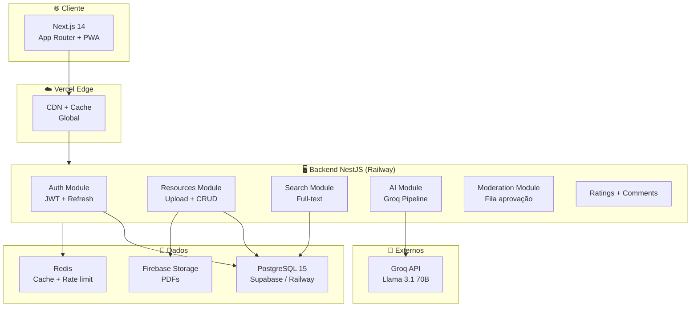
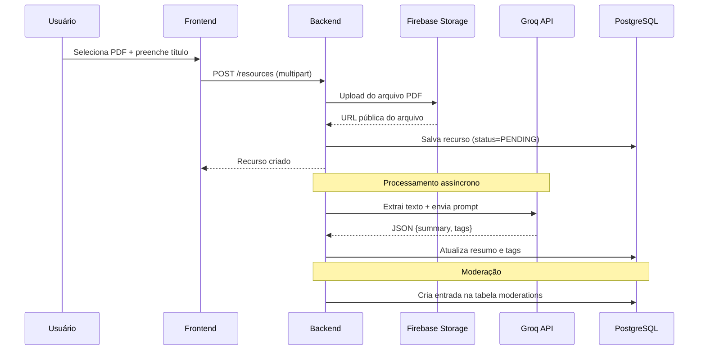
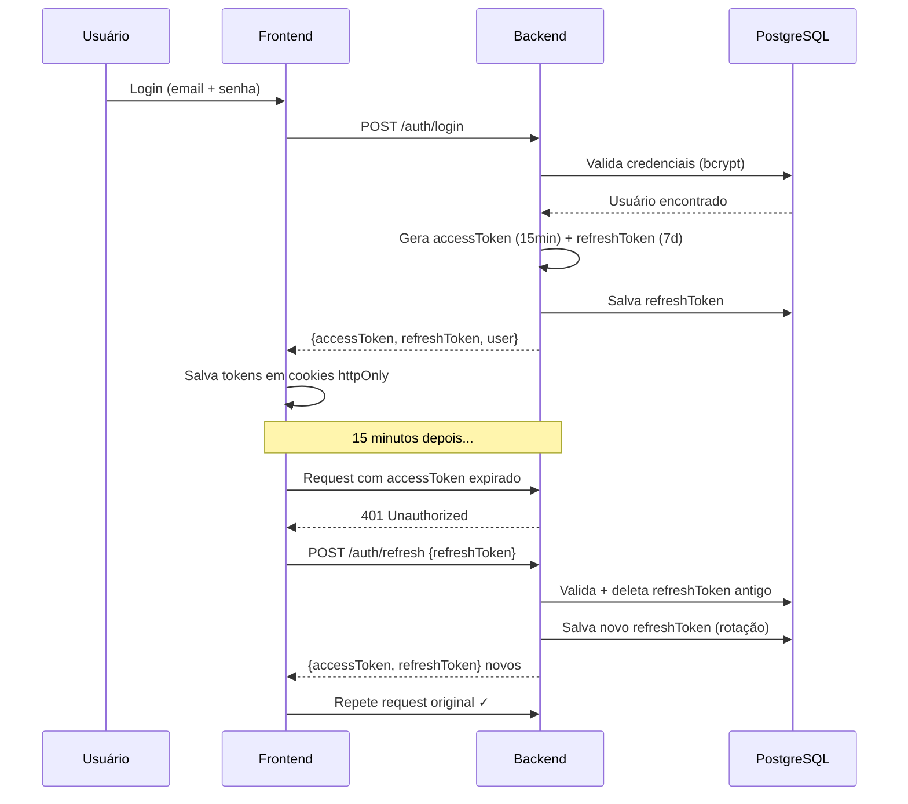
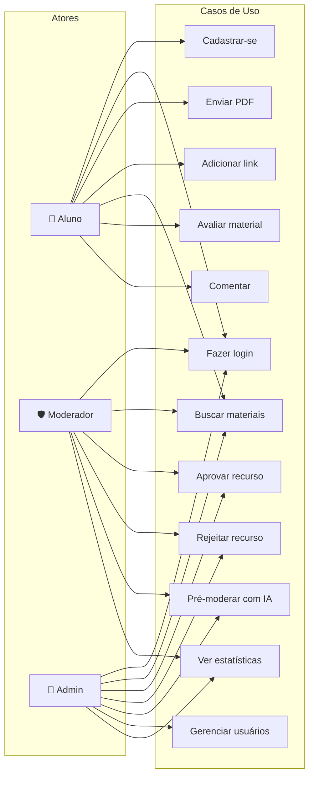

# Arquitetura do BibliON Campus

## Visão Geral

O BibliON Campus adota uma arquitetura **Modular Monolith** no backend, evitando a complexidade de microserviços para um projeto acadêmico sem perder a organização e escalabilidade necessárias.

## Diagrama de Arquitetura

## Fluxo de Upload com IA

## Fluxo de Autenticação

## Diagrama de Casos de Uso

## Padrões Arquiteturais Adotados

### Repository Pattern via Prisma
Cada módulo acessa o banco exclusivamente via `PrismaService`, nunca com SQL manual na camada de controller.

### DTO Pattern com class-validator
Todos os inputs passam por DTOs com validação declarativa antes de chegar ao service.

### Guard + Decorator para RBAC
Autorização baseada em roles usando `@Roles(Role.MODERATOR)` + `RolesGuard`, evitando repetição de lógica.

### Interceptores globais
Transformação automática de payload e logging centralizados via interceptores NestJS.

## Decisões Arquiteturais Justificadas

| Decisão | Alternativa | Justificativa |
|---|---|---|
| NestJS | Express puro | Força boas práticas (DI, módulos, decorators) |
| PostgreSQL | MongoDB | Dados relacionais + full-text search nativo |
| Prisma | TypeORM | Melhor DX, migrations automáticas, type-safety |
| App Router Next.js 14 | Pages Router | RSC, layouts aninhados, melhor performance |
| Groq API | OpenAI | 100% gratuito no free tier, latência baixa |
| Firebase Storage | AWS S3 | Sem cartão de crédito, SDK simples |
| JWT + Refresh | Session | Stateless, escalável, compatível com mobile |
