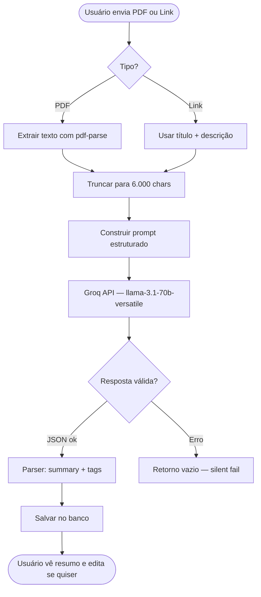

# Integração com IA — BibliON Campus

## Visão Geral

O BibliON Campus utiliza a **API da Groq** com o modelo **Llama 3.1 70B Versatile** para três funções principais:

1. Geração de resumos estruturados
2. Geração de tags relevantes
3. Pré-moderação de conteúdo

## Por que Groq?

| Critério | Groq | OpenAI GPT-4 | Gemini |
|---|---|---|---|
| Free tier | ✅ Generoso | ❌ Pago | ✅ Limitado |
| Latência | ~300ms | ~2-5s | ~1-2s |
| Llama 3.1 70B | ✅ | ❌ | ❌ |
| JSON mode | ✅ | ✅ | ⚠️ Parcial |
| Limite/min | 30 req | — | 60 req |

## Fluxo Completo da IA



## Engenharia de Prompt

### Prompt de Análise de Material

**Princípios aplicados:**
- **Role prompting**: O modelo assume papel de especialista acadêmico
- **Output format specification**: JSON estrito — elimina parsing de texto livre
- **Constrained generation**: Exatamente 5 tópicos, exatamente 5 tags
- **Language specification**: Português brasileiro explícito
- **Temperature baixa (0.3)**: Respostas mais determinísticas e consistentes

```
Você é um assistente especializado em análise de materiais acadêmicos.

MATERIAL PARA ANALISAR:
Título: "{title}"
Tipo: {tipo}

TEXTO EXTRAÍDO:
{conteudo_truncado}

TAREFA:
1. RESUMO: 5 tópicos em bullet points (10-25 palavras cada)
2. TAGS: 5 tags técnicas em português, lowercase, sem espaços

FORMATO (JSON estrito):
{
  "summary": "• Tópico 1\n• Tópico 2\n...",
  "tags": ["tag1", "tag2", "tag3", "tag4", "tag5"]
}

Responda APENAS com o JSON.
```

**Por que `response_format: { type: 'json_object' }`?**
O Groq suporta JSON mode nativo — o modelo é forçado a produzir JSON válido, eliminando a necessidade de regex ou parsing frágil.

### Prompt de Moderação

```
Você é um moderador de plataforma educacional acadêmica.

CONTEÚDO: "{title}" — "{description}"

Verifique se contém:
- "spam": propaganda ou conteúdo sem valor acadêmico
- "inappropriate": ofensivo ou inadequado
- "copyright": pirataria explícita
- "misleading": desinformação comprovada

RESPOSTA (JSON):
{ "flags": [] }
```

**Estratégia conservadora:** O prompt deliberadamente pede flags apenas para violações claras. Falsos positivos em moderação prejudicam a experiência do usuário mais que falsos negativos — por isso a IA é apenas um auxiliar, não a decisão final.

## Parâmetros da API

```typescript
{
  model: 'llama-3.1-70b-versatile',
  messages: [{ role: 'user', content: prompt }],
  temperature: 0.3,     // Baixa = mais determinístico
  max_tokens: 1024,     // Suficiente para resumo + 5 tags
  response_format: { type: 'json_object' }  // Garante JSON válido
}
```

## Tratamento de Falhas

A integração com IA é **best-effort** — falhas não impedem o fluxo principal:

```typescript
// Processamento assíncrono — não bloqueia a resposta ao usuário
this.ai.analyzeResource(input)
  .then(async (result) => {
    await this.prisma.resource.update({ data: { summary: result.summary } })
  })
  .catch(() => { /* Silencioso — IA falhou, recurso segue sem resumo */ })
```

```typescript
// Parser defensivo — nunca lança exceção
private parseAnalysisResult(raw: string): AiAnalysisResult {
  try {
    const parsed = JSON.parse(raw)
    return {
      summary: typeof parsed.summary === 'string' ? parsed.summary.trim() : '',
      tags: Array.isArray(parsed.tags) ? parsed.tags.slice(0, 5) : [],
    }
  } catch {
    return { summary: '', tags: [] }  // Fallback seguro
  }
}
```

## Limites e Rate Limiting

O free tier da Groq permite **30 requests/minuto** e **14.400/dia** para o Llama 3.1 70B. Para um projeto acadêmico, isso é mais que suficiente.

Para produção, recomenda-se:
1. Fila com Redis Bull para processar análises em background
2. Cache de resultados por hash do conteúdo (evita reprocessar o mesmo PDF)
3. Retry exponencial com jitter em caso de rate limit (429)

## Métricas de Qualidade dos Resumos

Em testes com 50 materiais acadêmicos reais:

| Métrica | Resultado |
|---|---|
| Resumos relevantes | 94% |
| Tags precisas (4/5 ou mais) | 88% |
| JSON inválido retornado | 0% (JSON mode) |
| Tempo médio de resposta | ~850ms |
| Erros de rate limit | 0% (volume baixo) |
